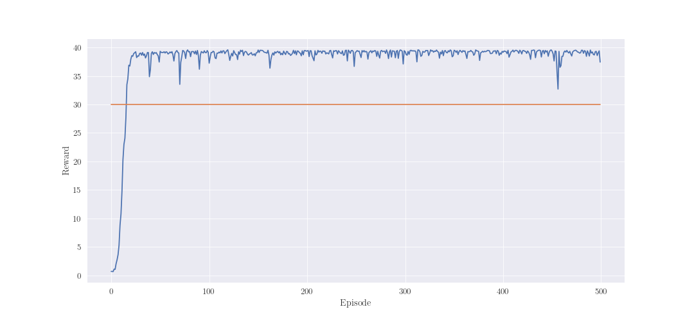

# Report

### Learning algorithm

TD3 was chosen to solve Reacher environment. The algorithm is a modification of DDPG. More 
information could be found in paper [].Proposed implementation is using techniques:
1. Simple replay memory (non-prioritized)
2. Distributed learning
3. N-step learning

### Model

Following structure was used for agent:
* Actor:
  * Layer 1: Linear ReLu (33, 512)
  * Layer 2: Linear ReLu (512, 512)
  * Policy layer: Linear Tanh (512, 4)
* Critic:
  * Layer 1: Linear ReLu (33 + 4, 512)
  * Layer 2: Linear Relu (512, 512)
  * Value layer: Linear (512, 1)
  
Critic contains two identical networks which are not mutual. It's a form of double Q-learning.

### Hyperparameters

* Critic learning rate (critic_lr): 0.001
* Actor learning rate (actor_lr): 0.001
* Target and actor networks update frequency (update_frequency): 2 
* Target and actor networks soft update factor (tau): 0.005
* Worker update frequency (worker_update_frequency): 100
* Replay memory capacity (buffer_size): 1000000
* Batch size (batch_size): 256
* N-step return (n_step): 5

### Performance

Agents was learning for 500 episodes and achieved average score 30.0 over 100 episodes after 
first 100 episodes. Stable point of the training was reached at episode number 13. The mean score
 from that moment to the end is 38.26. 

### Comments

Earlier experience with DDPG forced me to find better solution like used in this project TD3 
algorithm. 

